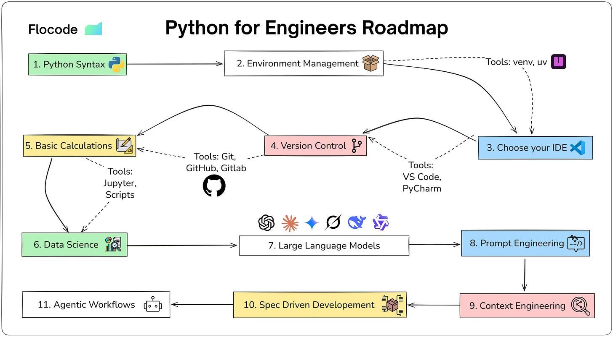

# 05 - The Path

## Modules

- [01 - Intro](01%20-%20Intro.md)
- [02 - Python in Engineering](02%20-%20Python%20in%20Engineering.md)
- [03 - Essence of Programming](03%20-%20Essence%20of%20Programming.md)
- [04 - The Community](04%20-%20The%20Community.md)
- [05 - The Path](05%20-%20The%20Path.md)

As we conclude this introductory course to the Flocode Curriculum let's briefly recap the key points we've covered:

- **Python's Role in Engineering**: We delved into how Python has become an integral part of the engineering landscape. From basic calculations to complex data analysis and automation.
- **Foundation in Programming:** We explored fundamental programming principles, paving the way for advanced study and application of Python in engineering tasks. The freedom in design of programming is vast. Thinking programmatically is a new paradigm and it’s a skill that has no finish line. We will build a momentum throughout the Flocode courses to allow you to pursue your personal areas of interest.
- **Community Engagement:** We discussed Flocode’s plan to build a vibrant community of engineers, learning and progressing together. We might as well have a good time along the way.

## The Python for Engineering Road Map

The Road Map is based on a Flocode newsletter article: [**#010 - A Roadmap for Learning Python for Civil/Structural Engineering](https://flocode.substack.com/p/a-roadmap-for-learning-python-for).** The link is below in the description, you can check it out for a much more detailed overview of this topic.

This summarized version is my suggested sequential curriculum, and is based on my personal preferences and experience. There’s no hard and fast rule for this. You just need to put on your goggles and dive in.

- **Introduction to Python**
  - Installation and setup
  - Basic syntax and command line operations
  - Understanding of data types, variables, and operators
- **Control Structures and Functions**
  - Conditional statements
  - Loops: for, while, break, pass, ranges
  - Defining and using functions
- **Data Handling**
  - Lists, tuples, dictionaries, and sets
  - File I/O basics
  - Introduction to pandas for data analysis and spreadsheet manipulation
- **Numerical Computation and Engineering Libraries**
  - NumPy for numerical and scientific computation
  - SciPy for additional functionality on top of NumPy
- **Data Visualization**
  - Matplotlib or Plotly for creating static, animated, and interactive visualizations
  - Seaborn for statistical data visualization

This much will get you pretty far, once you feel comfortable with all of these topics, it’s time to move towards intermediate Python development concepts.

- **Intermediate Python Concepts**
  - Git and Version Control
  - Object-Oriented Programming
  - Building local apps, web apps or interactive dashboards with GUI’s ([Shiny](https://shiny.posit.co/py/), [Solara](https://solara.dev/), [Streamlit](https://streamlit.io/), [Gradio](https://www.gradio.app/) and others)
  - Connecting services, API’s and Data Streams
  - Error and exception handling
  - Debugging and testing Python code
  - Performance optimization techniques
  - More advanced Python programming principles (the language is incredibly deep)
- **Interfacing with Engineering Software**
  - Inter-application communication and control using Component Object Models and API protocols including things like:
    - Automating CAD/Revit software with Python scripts
    - Using Python with structural analysis software (e.g., SAP2000, ETABS, ANSYS)
- Once you get this far you are well on your way to paving your own path and exploring avenues of personal interest and relevance to your role or career aspirations. We can cover these more advanced discussions in future videos.

I believe you can learn anything you want by yourself, provided you're stubborn enough. That's how I did it. While I don't regret it, there's a much better way.

Flocode's courses are designed to teach you all of this material and more in an engineering context using engineering examples.

If you would rather dive in on your own terms, I completely understand because that’s what I did, although it took me many more years than it needed to. Either way I wish you the very best of luck! ☘️

Just remember it's a marathon, not a sprint.

## Python Roadmap

This roadmap reflects a comprehensive learning path for Python in engineering. Each node represents a deep topic, you don't need expertise in every area to use Python effectively. The Intermediate course focuses on the foundational workflows that enable you to explore specialized areas as your projects demand.

Treat it as a map, not a checklist.

# The Flocode Curriculum

OK now I want to run through the flocode curriculum. We will just be skimming the surface since there is so much to discuss but I think this will help give you some perspective on the path ahead and how Flocode approaches the subject of adopting Python for professional Engineering.

First up:

## **Python for Engineers: Intro (Free)**

That’s this course, where Introduced Python and its significance in our profession.

- Hopefully by now you have a broad understanding of Python's potential in engineering and that it really is worth digging deeper into programming.

## **Next**

1. Python for Engineers Essentials Course: establishing a strong foundation in Python programming, focusing on core concepts and their application in solving simple engineering problems
2. Python for Engineers Intermediate Course: bridging the gap between fundamental Python programming and its practical application in standard engineering tasks, covering object-oriented programming, error handling, and more advanced data structures
3. Python for Engineers Advanced Course: exploring sophisticated engineering challenges and how Python addresses them, including simulations, optimization, tool integration, and creating custom Python tools
4. Python for Engineers Expert Course: pushing forward with new tools, data engineering, machine learning, and advanced simulations, enabling you to develop your own custom Python applications and workflows for specific engineering problems
5. Python for Engineer Specializations Modules: tailored Python learning paths for specific engineering disciplines, addressing unique challenges and opportunities in each field

## Next Steps

I encourage all engineers to embrace Python. Whether you're looking to streamline your workflows, engage in innovative projects, or simply expand your skill set, Python offers a world of opportunities. It's more than simply learning a new skill; you’re equipping yourself with a tool that can significantly enhance your engineering capabilities and open you up to new ways to find solutions.

You will be amazed at the utility of it for areas of personal interest outside engineering, for me, that includes finance, web development, automation, music production and whatever you might be interested in.

Looking ahead, the flocode courses will continue to unravel the potential of Python in engineering. We will dive deeper into specific applications, covering many areas of focus in civil and structural engineering, from the ground up.

For those eager to continue this learning journey, visit [flocode.dev](https://flocode.dev). You can find what you need there.

Additionally, to stay updated on the latest trends, insights, educational materials, and everything that we're building here at Flocode, make sure you are subscribed to our newsletter at [https://flocode.substack.com](https://flocode.substack.com). The newsletter is an excellent way to keep in touch with the community, discover new applications of Python in engineering, and get regular updates on how the Flocode project is progressing.

---

Keep innovating, and I look forward to seeing you inside the Flocode Community.

James 🌊
